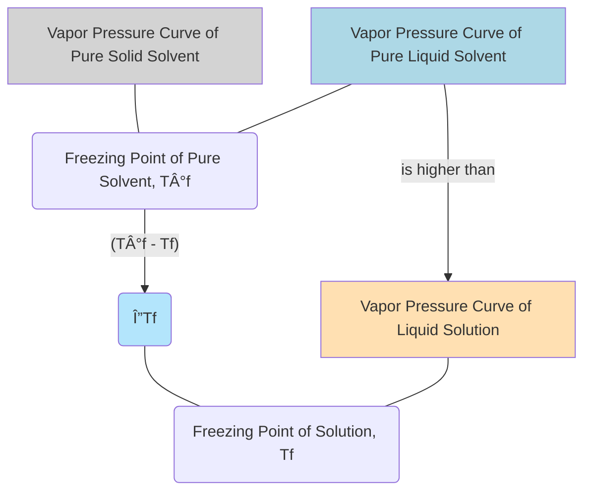

Alright, my diligent student! I love your enthusiasm to master this chapter. Let's tackle this in a way that makes it stick, using Obsidian's markdown features to make everything super clear.

---

# 📚 Solutions: Chapter Deep Dive

## Introduction to Solutions

As you know, a **solution** is a [[Homogeneous Mixture]] of two or more substances.
*   **Solute**: The substance being dissolved (usually in a smaller amount).
*   **Solvent**: The substance doing the dissolving (usually in a larger amount).

Most of our discussion will revolve around **binary solutions**, containing one solute and one solvent.

---

## 🧪 Q.5: Calculating Amount of Urea (Molarity)

Let's start with your first problem, which focuses on **Molarity**, a fundamental concept for expressing solution concentration.

### Problem Statement
**Q.5 Calculate the amount of urea (NHâ‚‚CONHâ‚‚) which is dissolved in 250ml Solution (molarity is M/40)**

### Concept 1: Molarity (M)

**Definition**: Molarity (M) is defined as the **number of moles of solute per liter of solution**. It's a measure of how concentrated a solution is.

**Formula**:
$$ M = \frac{\text{Moles of solute (n)}}{\text{Volume of solution (V in Liters)}} $$

**Units**:
*   **Molarity (M)**: moles/Liter (mol/L) or simply 'M'.
*   **Moles of solute (n)**: moles (mol).
    *   Recall: $$ n = \frac{\text{Mass of substance (g)}}{\text{Molar mass of substance (g/mol)}} $$
*   **Volume of solution (V)**: Liters (L).
    *   **Crucial Conversion**: If given in milliliters (mL), convert to Liters:
        $$ \text{Volume (L)} = \frac{\text{Volume (mL)}}{1000} $$

### Step-by-Step Solution for Q.5

Let's break down the problem using the information provided in your notes.

**Given Information**:
*   Molarity of Solution ($M$) = $M/40$ (which means $\frac{1}{40}$ M or 0.025 M)
*   Volume of Solution ($V$) = 250 mL
*   Solute: Urea (NHâ‚‚CONHâ‚‚)

**What we need to find**:
*   Weight of Urea ($W_B$), which is the mass of the solute in grams.

---

#### Step 1: Calculate the Molar Mass of Urea ($M_B$)

Urea's chemical formula is NHâ‚‚CONHâ‚‚.
*   Nitrogen (N): 14.01 g/mol
*   Hydrogen (H): 1.008 g/mol
*   Carbon (C): 12.01 g/mol
*   Oxygen (O): 16.00 g/mol

Counting atoms: 2 Nitrogen, 4 Hydrogen, 1 Carbon, 1 Oxygen.
$$ M_B (\text{Urea}) = (2 \times 14.01) + (4 \times 1.008) + (1 \times 12.01) + (1 \times 16.00) $$
$$ M_B = 28.02 + 4.032 + 12.01 + 16.00 $$
$$ M_B \approx 60.06 \text{ g/mol} $$
*(Your notes use 60 g/mol, which is a perfectly acceptable rounded value for this calculation.)*

So, $M_B = 60 \text{ g/mol}$.

---

#### Step 2: Use the Molarity Formula to find the Mass of Urea

Your notes use a combined formula, which is efficient:
$$ M = \frac{W_B \times 1000}{M_B \times V_{\text{mL}}} $$
Where:
*   $W_B$ = Mass of solute in grams
*   $M_B$ = Molar mass of solute in g/mol
*   $V_{\text{mL}}$ = Volume of solution in milliliters

Let's plug in the given values:
$$ \frac{1}{40} = \frac{W_B \times 1000}{60 \times 250} $$

Now, simplify the right side:
$$ \frac{1}{40} = \frac{W_B \times 1000}{15000} $$
$$ \frac{1}{40} = \frac{W_B \times 10}{150} $$
$$ \frac{1}{40} = \frac{W_B}{15} $$

To solve for $W_B$, cross-multiply:
$$ 1 \times 15 = 40 \times W_B $$
$$ 15 = 40 W_B $$
$$ W_B = \frac{15}{40} $$

Simplify the fraction:
$$ W_B = \frac{3}{8} \text{ g} $$

And in decimal form:
$$ W_B = 0.375 \text{ g} $$

---

**Final Answer for Q.5**:
The amount of urea dissolved is **0.375 grams**.

---

### Key Takeaways for Molarity:
*   Always remember the units: moles per **liter**.
*   Molar mass is crucial for converting between grams and moles.
*   The combined formula can save a step, but understanding the basic definition is more important for conceptual grasp.

How does that feel? Is Q.5 and the concept of Molarity clear? Once you're comfortable, we'll move on to the next problem, Q.6, which introduces [[Mole Fraction]].

Excellent! Onward to Q.6, which introduces another crucial way to express concentration: **Mole Fraction**. This concept is particularly important when dealing with colligative properties, which we'll cover later.

---

## 🧪 Q.6: Calculating Mole Fraction of Components

### Problem Statement
**Q.6 In a Solution according to mass 30% acetic acid and 30% ethanol and 40% water. Calculate the mole fraction of each Component.**

This problem asks us to find the mole fraction for *each* component in a solution where the composition is given by mass percentages.

### Concept 2: Mole Fraction ($\chi$)

**Definition**: Mole fraction ($\chi$) is defined as the **ratio of the number of moles of one component to the total number of moles of *all* components in the solution**. It's a dimensionless quantity (it has no units).

**Formula**:
For a component 'A' in a solution containing components A, B, C...
$$ \chi_A = \frac{\text{Number of moles of A (n}_A\text{)}}{\text{Total number of moles (n}_{\text{total}}\text{)}} $$
Where, $$ n_{\text{total}} = n_A + n_B + n_C + ... $$

**Key Properties of Mole Fraction**:
*   The sum of the mole fractions of all components in a solution is always equal to **1**.
    *   $$ \chi_A + \chi_B + \chi_C + ... = 1 $$
*   It's useful because it doesn't change with temperature (unlike molarity, which depends on volume).

### Step-by-Step Solution for Q.6

Let's break down the problem. We have a solution with three components: Acetic Acid, Ethanol, and Water.

**Given Information (from your notes and problem statement)**:
The solution is described by mass percentages:
*   30% Acetic Acid
*   30% Ethanol
*   40% Water

To make calculations easier, we often *assume* a total mass for the solution. A common and convenient assumption is **100 grams of solution**.

If we assume 100 grams of solution:
*   Mass of Acetic Acid ($W_A$) = 30% of 100 g = 30 g
*   Mass of Ethanol ($W_B$) = 30% of 100 g = 30 g
*   Mass of Water ($W_C$) = 40% of 100 g = 40 g

*(This matches the "Ans Given" section in your notes.)*

---

#### Step 1: Calculate the Molar Mass for Each Component

To convert mass to moles, we need the molar mass for each substance.

*   **Acetic Acid (CH₃COOH)**:
    *   C: 12.01 g/mol
    *   H: 1.008 g/mol
    *   O: 16.00 g/mol
    *   Formula: 2 C, 4 H, 2 O
    *   Molar mass ($M_A$) = $(2 \times 12.01) + (4 \times 1.008) + (2 \times 16.00)$
    *   $M_A = 24.02 + 4.032 + 32.00 = 60.052 \text{ g/mol}$
    *   *(Your notes use 60 g/mol)*. Let's use $M_A = 60 \text{ g/mol}$.

*   **Ethanol (Câ‚‚Hâ‚…OH)**:
    *   C: 12.01 g/mol
    *   H: 1.008 g/mol
    *   O: 16.00 g/mol
    *   Formula: 2 C, 6 H, 1 O
    *   Molar mass ($M_B$) = $(2 \times 12.01) + (6 \times 1.008) + (1 \times 16.00)$
    *   $M_B = 24.02 + 6.048 + 16.00 = 46.068 \text{ g/mol}$
    *   *(Your notes use 46 g/mol)*. Let's use $M_B = 46 \text{ g/mol}$.

*   **Water (Hâ‚‚O)**:
    *   H: 1.008 g/mol
    *   O: 16.00 g/mol
    *   Formula: 2 H, 1 O
    *   Molar mass ($M_C$) = $(2 \times 1.008) + (1 \times 16.00)$
    *   $M_C = 2.016 + 16.00 = 18.016 \text{ g/mol}$
    *   *(Your notes use 18 g/mol)*. Let's use $M_C = 18 \text{ g/mol}$.

---

#### Step 2: Calculate the Number of Moles for Each Component ($n = \frac{\text{Mass}}{\text{Molar mass}}$)

*   **Moles of Acetic Acid ($n_A$)**:
    $$ n_A = \frac{30 \text{ g}}{60 \text{ g/mol}} = 0.5 \text{ mol} $$

*   **Moles of Ethanol ($n_B$)**:
    $$ n_B = \frac{30 \text{ g}}{46 \text{ g/mol}} \approx 0.652 \text{ mol} $$
    *(Your notes round this to 0.65 mol, which is fine for the next steps.)*

*   **Moles of Water ($n_C$)**:
    $$ n_C = \frac{40 \text{ g}}{18 \text{ g/mol}} \approx 2.222 \text{ mol} $$
    *(Your notes round this to 2.22 mol.)*

---

#### Step 3: Calculate the Total Number of Moles ($n_{\text{total}}$)

$$ n_{\text{total}} = n_A + n_B + n_C $$
$$ n_{\text{total}} = 0.5 \text{ mol} + 0.65 \text{ mol} + 2.22 \text{ mol} $$
$$ n_{\text{total}} = 3.37 \text{ mol} $$

---

#### Step 4: Calculate the Mole Fraction for Each Component ($\chi = \frac{n}{\text{n}_{\text{total}}}$)

*   **Mole fraction of Acetic Acid ($\chi_A$)**:
    $$ \chi_A = \frac{n_A}{n_{\text{total}}} = \frac{0.5 \text{ mol}}{3.37 \text{ mol}} \approx 0.148 $$
    *(Your notes round this to 0.14.)*

*   **Mole fraction of Ethanol ($\chi_B$)**:
    $$ \chi_B = \frac{n_B}{n_{\text{total}}} = \frac{0.65 \text{ mol}}{3.37 \text{ mol}} \approx 0.193 $$
    *(Your notes round this to 0.19.)*

*   **Mole fraction of Water ($\chi_C$)**:
    $$ \chi_C = \frac{n_C}{n_{\text{total}}} = \frac{2.22 \text{ mol}}{3.37 \text{ mol}} \approx 0.658 $$
    *(Your notes round this to 0.65.)*

---

**Final Answers for Q.6**:
*   Mole fraction of Acetic Acid ($\chi_A$) $\approx$ **0.14**
*   Mole fraction of Ethanol ($\chi_B$) $\approx$ **0.19**
*   Mole fraction of Water ($\chi_C$) $\approx$ **0.65**

**Check**: Let's sum them up to see if it's close to 1:
$0.14 + 0.19 + 0.65 = 0.98$.
The slight deviation from 1 is due to rounding at each step. If we used more decimal places, it would be closer to 1. This is a good way to quickly verify your calculations!

---

### Key Takeaways for Mole Fraction:
*   Mole fraction depends only on the *moles* of components, not their mass or volume.
*   Always sum up to find the total moles first.
*   The sum of all mole fractions should be 1.

Does this explanation of Mole Fraction and the solution to Q.6 make perfect sense? Let me know if anything needs further clarification before we move to Q.7!

Excellent! Let's tackle Q.7. This question is a great way to solidify your understanding of both Molarity and introduce another key concentration term: **Molality**.

---

## 🧪 Q.7: Molarity and Molality of Pure Water

### Problem Statement
**Q.7 Prove that the molarity and molality of pure water is always one or equal.**
*(Your notes arrive at a value of ~55.56, demonstrating that they are equal, not necessarily "one". We'll address this in the explanation.)*

This question asks us to compare Molarity and Molality for a very specific and common substance: pure water.

### Concept 3: Molality (m)

We've already covered Molarity (M). Now, let's look at **Molality (m)**. It sounds similar to Molarity, but there's a crucial difference!

**Definition**: Molality (m) is defined as the **number of moles of solute per kilogram of *solvent***.

**Formula**:
$$ \text{Molality (m)} = \frac{\text{Number of moles of solute (n)}}{\text{Mass of solvent (W in kg)}} $$

**Units**:
*   **Molality (m)**: moles/kilogram (mol/kg) or simply 'm'.
*   **Moles of solute (n)**: moles (mol).
*   **Mass of solvent (W)**: Kilograms (kg).
    *   **Crucial Conversion**: If given in grams (g), convert to Kilograms:
        $$ \text{Mass (kg)} = \frac{\text{Mass (g)}}{1000} $$

**Key Difference from Molarity**:
*   **Molarity** uses **volume of *solution*** (which changes with temperature).
*   **Molality** uses **mass of *solvent*** (which does not change with temperature).
    *   This makes molality useful for situations where temperature changes are relevant, or when we want to focus specifically on the solvent's quantity.

---

### Step-by-Step Proof for Q.7 (Pure Water)

For pure water, there is no *solute* in the traditional sense. However, to calculate its "molarity" and "molality" in a way that makes sense, we consider a specific amount of water and treat *itself* as the "solution" or "solvent" for calculation purposes.

Let's consider a standard amount for easy calculation: **1000 mL (or 1 Liter) of pure water**.

#### Part A: Calculating Molarity of Pure Water

1.  **Volume of "solution"**: Assume $V = 1000 \text{ mL} = 1 \text{ L}$.
2.  **Mass of water**: The density of pure water at room temperature is approximately $1 \text{ g/mL}$ (or $1 \text{ kg/L}$).
    So, for $1000 \text{ mL}$ of water, the mass is $1000 \text{ g}$.
3.  **Molar mass of water (Hâ‚‚O)**:
    *   H: 1.008 g/mol
    *   O: 16.00 g/mol
    *   $M_{\text{Hâ‚‚O}} = (2 \times 1.008) + 16.00 = 18.016 \text{ g/mol}$ (Your notes use 18 g/mol). Let's use $M_{\text{Hâ‚‚O}} = 18 \text{ g/mol}$.
4.  **Number of moles of water**:
    $$ n_{\text{Hâ‚‚O}} = \frac{\text{Mass of water}}{\text{Molar mass of water}} = \frac{1000 \text{ g}}{18 \text{ g/mol}} \approx 55.56 \text{ mol} $$
5.  **Calculate Molarity**:
    $$ M = \frac{n_{\text{Hâ‚‚O}}}{V_{\text{L}}} = \frac{55.56 \text{ mol}}{1 \text{ L}} = 55.56 \text{ M} $$

So, the Molarity of pure water is approximately **55.56 M**.

---

#### Part B: Calculating Molality of Pure Water

1.  **Mass of "solvent"**: We're using $1000 \text{ g}$ of water, which is $1 \text{ kg}$. So, $W = 1 \text{ kg}$.
2.  **Number of moles of water**: As calculated above, $n_{\text{Hâ‚‚O}} \approx 55.56 \text{ mol}$.
3.  **Calculate Molality**:
    $$ m = \frac{n_{\text{Hâ‚‚O}}}{W_{\text{kg}}} = \frac{55.56 \text{ mol}}{1 \text{ kg}} = 55.56 \text{ m} $$

So, the Molality of pure water is approximately **55.56 m**.

---

### Conclusion for Q.7

From the calculations, we can clearly see that:
$$ \text{Molarity of pure water} \approx 55.56 \text{ M} $$
$$ \text{Molality of pure water} \approx 55.56 \text{ m} $$

Therefore, for pure water, its molarity and molality are **equal** to each other (approximately 55.56).
The phrase "always one or equal" in the question might be slightly confusing; it's the "equal" part that is demonstrated, with the value being 55.56, not 1.

---

### Key Takeaways for Molarity vs. Molality:
*   **Molarity (M)**: moles of solute / **Liters of SOLUTION**.
*   **Molality (m)**: moles of solute / **Kilograms of SOLVENT**.
*   Molality is independent of temperature changes, while molarity is not.
*   For pure substances (like water), these values can be calculated and turn out to be equal.

Does this explanation, including the distinction between Molarity and Molality, clarify Q.7 for you? Let's move on when you're ready!

Alright, fantastic! Let's move on to Q.8, which introduces a fundamental and very important concept in this chapter: **Colligative Properties**. These properties are key to understanding how adding a solute affects a solvent.

---

## 🧪 Q.8: What are Colligative Properties?

### Problem Statement
**Q.8 what is Colligative property ?**

### Concept 4: Colligative Properties

The word "colligative" comes from the Latin word "colligatus," meaning "bound together." In chemistry, it refers to properties that are "tied together" by the number of particles.

**Definition**:
**Colligative properties** are properties of solutions that depend *only* on the **number of solute particles** (or concentration of solute particles) present in the solution, and *not* on the **nature (identity)** of the solute itself.

Think of it like this: Imagine you have a party. Certain things about the party might depend on *how many* guests are there (e.g., how much food you need, how loud it gets), regardless of *who* those guests are. Colligative properties are like those "number-dependent" party characteristics.

#### Key Characteristics:
1.  **Depends on Number, Not Nature**: This is the most critical point. Whether you add sugar, salt, or urea to water, if you add the *same number of particles*, the colligative property change will be the same.
2.  **Ideal Solutions**: These properties are best observed and most accurately predicted in [[Ideal Solutions]] and dilute solutions.
3.  **Non-Volatile Solute**: We typically discuss colligative properties with [[Non-volatile Solute]]s, meaning the solute does not easily vaporize. This simplifies the behavior of the solution.

#### The Four Main Colligative Properties:
Your notes correctly list these, and we will explore each of them in detail in subsequent questions.

1.  **[[Relative Lowering of Vapour Pressure]] (RLVP)**: Adding a non-volatile solute lowers the vapor pressure of the solvent.
2.  **[[Elevation of Boiling Point]] ($\Delta T_b$)**: Adding a non-volatile solute raises the boiling point of the solvent.
3.  **[[Depression of Freezing Point]] ($\Delta T_f$)**: Adding a non-volatile solute lowers the freezing point of the solvent.
4.  **[[Osmotic Pressure]] ($\Pi$)**: The pressure required to stop osmosis across a semi-permeable membrane.

---

### Simple Example to Illustrate "Number, Not Nature"

Let's use a very simplified analogy:
Imagine you have a bucket of pure water.
*   If you add 10 small, red marbles (Solute A), they will block a certain amount of the water's surface, affecting how easily water molecules escape into the air (vapor pressure).
*   If you remove the red marbles and instead add 10 small, blue marbles (Solute B) of the *same size* and *same number*, they will block the *same amount* of water surface. The effect on the vapor pressure will be the same, even though the marbles are a different color (different "nature").

In chemistry, "marbles" are solute particles (ions or molecules). Whether they are sugar molecules or sodium ions, if there's the same *count* of them, the colligative properties are affected similarly.

*(It's important to note for ionic compounds like NaCl, they dissociate into ions (Na⺠and Clâ»), so 1 mole of NaCl gives 2 moles of particles. This is a crucial detail for calculations involving colligative properties!)*

---

### Conclusion for Q.8

In essence, colligative properties are solution properties that are a direct consequence of how many foreign particles are mixed into a solvent, rather than what those particles actually are. They are about the *quantity* of the solute, not its specific chemical identity.

Does this explanation of colligative properties make sense? Do you see why "number, not nature" is the key phrase? Once you're clear on this, we'll move to Q.9, which starts defining these properties individually!

You're absolutely right! My apologies. Let's make sure we're using those Obsidian features to their fullest for clarity and organization. Here's Q.9 with all the requested formatting.

---

# 📚 Solutions: Chapter Deep Dive

## Q.9: Vapour Pressure & Lowering of Vapour Pressure

### Problem Statement
**Q.9 Define the following:**
**i) Vapour pressure**
**ii) Lowering of vapour pressure**

This question asks for fundamental definitions that are crucial for understanding [[Colligative Properties]].

### Concept 5: Vapour Pressure ($P^\circ_A$)

Imagine a sealed container with a pure liquid (e.g., [[Pure Water]]) at a constant temperature.

**Explanation**:
1.  **Evaporation**: Liquid molecules at the surface gain enough kinetic energy to escape into the gas phase above the liquid.
2.  **Condensation**: Gaseous molecules collide with the liquid surface and return to the liquid phase.
3.  **Equilibrium**: In a closed system, a dynamic equilibrium is established where the rate of evaporation equals the rate of condensation.

**Definition**:
**Vapour pressure** is the pressure exerted by the vapor molecules in equilibrium with the liquid phase at a constant temperature in a closed container.

*   **Notation**:
    *   For a pure solvent, it is typically denoted as $P^\circ_A$ (where A is the solvent) or sometimes just $P^\circ$.
*   **Factors Affecting Vapour Pressure**:
    *   **Temperature**: $\uparrow$ Temperature $\implies \uparrow$ Vapour Pressure (more molecules have energy to escape).
    *   **Nature of Liquid**: Liquids with weaker intermolecular forces (e.g., diethyl ether) have higher vapour pressures than those with stronger forces (e.g., water).

#### Diagrammatic Representation (Conceptual)

*At equilibrium, the pressure exerted by molecules in the Vapor Phase is the Vapour Pressure.*

---

### Concept 6: Lowering of Vapour Pressure ($\Delta P$)

Now, let's consider what happens when a [[Non-volatile Solute]] is introduced into our pure solvent.

**Explanation**:
When a non-volatile solute is dissolved in a solvent to form a solution:
1.  **Reduced Surface Area for Solvent**: Some of the solvent molecules at the surface are replaced by non-volatile solute particles.
2.  **Decreased Evaporation Rate**: Fewer solvent molecules are available at the surface to escape into the vapor phase. The rate of evaporation of the solvent thus decreases.
3.  **Lower Vapor Concentration**: This leads to a lower concentration of solvent vapor molecules in the space above the solution at equilibrium.
4.  **Resulting Pressure Drop**: Consequently, the vapor pressure exerted by the solvent above the solution ($P_S$ or $P_A$) is lower than that of the pure solvent ($P^\circ_A$).

**Definition**:
**Lowering of vapour pressure** is the decrease in the vapor pressure of a solvent when a non-volatile solute is added to it, forming a solution.

*   **Mathematical Expression**:
    $$ \Delta P = P^\circ_A - P_S $$
    Where:
    *   $P^\circ_A$ = Vapour pressure of the [[Pure Solvent]]
    *   $P_S$ = Vapour pressure of the [[Solution]] (containing non-volatile solute)

#### Analogy: Blocked Exits
Imagine a room full of people trying to leave through a door (evaporation). If you place some non-moving obstacles in front of the door (non-volatile solute), fewer people can exit at any given time, reducing the "pressure" of people trying to get out.

---

### Key Summary Points for Q.9:
*   Vapour pressure is an equilibrium phenomenon for a pure liquid.
*   Adding a non-volatile solute *reduces* the number of solvent molecules at the surface.
*   This reduction leads to a *decrease* in the rate of evaporation and thus a *lower* vapour pressure for the solution compared to the pure solvent.
*   This lowering ($\Delta P$) is the first [[Colligative Property]] we're exploring.

Is this explanation clear and easy to follow with the Obsidian markdown? Let me know if you want any more detail before we jump into Q.10, which ties this concept to [[Raoult's Law]]!

Excellent! We're building a strong foundation. Let's move on to Q.10, which introduces **Raoult's Law** and formally connects the lowering of vapor pressure to the idea of a colligative property.

---

# 📚 Solutions: Chapter Deep Dive

## Q.10: Raoult's Law and Relative Lowering of Vapour Pressure

### Problem Statement
**Q.10 what is Roults law? Give its mathematical expressions prove that the relative lowering of vapour pressure is a Colligative property**

This question has three parts:
1.  Defining [[Raoult's Law]].
2.  Providing its mathematical expression.
3.  Proving that [[Relative Lowering of Vapour Pressure]] (RLVP) is a [[Colligative Property]].

### Concept 7: Raoult's Law (for non-volatile solute)

Raoult's Law is a fundamental relationship that describes the vapor pressure of a solvent in a solution. It's particularly useful when dealing with [[Non-volatile Solute]]s.

**Definition**:
**Raoult's Law states that for a solution containing a non-volatile solute, the partial vapor pressure of each volatile component (solvent) in the solution is directly proportional to its mole fraction in the solution.**

*   In simpler terms: The more solvent molecules there are in the mixture (relative to total molecules), the more of them can escape into the vapor phase, and thus the higher the vapor pressure contribution from that solvent.

**Mathematical Expression**:
If 'A' is the solvent and 'B' is the non-volatile solute, then the vapor pressure of the solvent in the solution ($P_A$ or $P_S$) is given by:

$$ P_A = \chi_A \times P^\circ_A $$

Where:
*   $P_A$ (or $P_S$) = Vapor pressure of the solvent *in the solution*
*   $\chi_A$ = [[Mole Fraction]] of the solvent *in the solution*
*   $P^\circ_A$ = Vapor pressure of the *pure solvent* at the same temperature

Since the solute 'B' is non-volatile, it does not contribute to the overall vapor pressure of the solution. Therefore, the total vapor pressure of the solution ($P_S$) is simply equal to $P_A$:
$$ P_S = P_A = \chi_A \times P^\circ_A $$

### Derivation: Relative Lowering of Vapour Pressure (RLVP)

Now, let's use Raoult's Law to derive the expression for the **Relative Lowering of Vapour Pressure** and show it's a colligative property.

We know from Q.9 that the **Lowering of Vapour Pressure** ($\Delta P$) is:
$$ \Delta P = P^\circ_A - P_S $$

Substitute Raoult's Law ($P_S = \chi_A \times P^\circ_A$) into this equation:
$$ \Delta P = P^\circ_A - (\chi_A \times P^\circ_A) $$
Factor out $P^\circ_A$:
$$ \Delta P = P^\circ_A (1 - \chi_A) $$

We also know that for a binary solution (solvent A and solute B), the sum of mole fractions is 1:
$$ \chi_A + \chi_B = 1 $$
Therefore, we can write:
$$ 1 - \chi_A = \chi_B $$

Substitute this back into the equation for $\Delta P$:
$$ \Delta P = P^\circ_A \times \chi_B $$

This equation tells us that the *lowering* of vapor pressure depends directly on the mole fraction of the solute and the vapor pressure of the pure solvent.

Now, let's define **Relative Lowering of Vapour Pressure (RLVP)**:
RLVP is the lowering of vapor pressure divided by the vapor pressure of the pure solvent.
$$ \text{RLVP} = \frac{\Delta P}{P^\circ_A} = \frac{P^\circ_A - P_S}{P^\circ_A} $$

Substitute $\Delta P = P^\circ_A \times \chi_B$ into this expression:
$$ \frac{P^\circ_A - P_S}{P^\circ_A} = \frac{P^\circ_A \times \chi_B}{P^\circ_A} $$

Simplifying, we get the key result:
$$ \frac{P^\circ_A - P_S}{P^\circ_A} = \chi_B $$

### Proof that Relative Lowering of Vapour Pressure is a Colligative Property

The final equation derived from Raoult's Law, $$ \frac{P^\circ_A - P_S}{P^\circ_A} = \chi_B $$
is the core of the proof.

**Here's why RLVP is a colligative property:**

1.  **Dependence on $\chi_B$**: The formula clearly shows that the Relative Lowering of Vapour Pressure is *equal to the mole fraction of the solute* ($\chi_B$).
2.  **Mole Fraction is Number-Dependent**: Recall that mole fraction ($\chi_B$) is defined as:
    $$ \chi_B = \frac{n_B}{n_A + n_B} $$
    Where $n_B$ is the number of moles of solute particles and $n_A$ is the number of moles of solvent particles.
3.  **Nature Independence**: Since $\chi_B$ depends *only on the number of moles (particles)* of the solute and solvent, and *not on the chemical identity or nature* of the solute 'B', the Relative Lowering of Vapour Pressure must also be a colligative property.

Whether the solute is sugar, urea, or any other non-volatile substance, as long as the *number of particles* (represented by $n_B$) is the same, the mole fraction $\chi_B$ will be the same (for a given amount of solvent), and thus the relative lowering of vapor pressure will be the same.

---

### Key Summary for Q.10:
*   **Raoult's Law**: $P_A = \chi_A \times P^\circ_A$
*   **Lowering of VP**: $\Delta P = P^\circ_A - P_S$
*   **Relative Lowering of VP**: $$ \frac{P^\circ_A - P_S}{P^\circ_A} = \chi_B $$
*   **Colligative Proof**: RLVP is directly equal to the mole fraction of the solute, which itself depends only on the *number* of solute particles, not their specific chemical *identity*.

Does this comprehensive explanation of Raoult's Law and the colligative nature of RLVP clarify everything? This is a really important concept to grasp! Let me know when you're ready to move to Q.11, which applies this to calculate molar mass.

Fantastic! Now that we've thoroughly understood Raoult's Law and why Relative Lowering of Vapor Pressure is a colligative property, let's apply this knowledge to a practical calculation in Q.11. This problem shows how we can use this colligative property to find an unknown molar mass.

---

# 📚 Solutions: Chapter Deep Dive

## Q.11: Calculating Molar Mass using Raoult's Law (RLVP)

### Problem Statement
**Q.11 Calculate the molar mass of nonvolatile solute with the help of Roults law.**

This question asks us to show *how* [[Raoult's Law]] (specifically the [[Relative Lowering of Vapour Pressure]] aspect) can be used to determine the molar mass of an unknown non-volatile solute. It's not asking for a specific numerical calculation, but rather the derivation of the formula.

### Recalling the Key Relationship

From our discussion on Q.10, we established that for a solution containing a [[Non-volatile Solute]] (B) and a solvent (A):

$$ \frac{P^\circ_A - P_S}{P^\circ_A} = \chi_B $$
Where:
*   $P^\circ_A$ = Vapor pressure of the pure solvent
*   $P_S$ = Vapor pressure of the solution
*   $\chi_B$ = Mole fraction of the solute

### Step-by-Step Derivation to Find Molar Mass ($M_B$)

Our goal is to express $M_B$ (the molar mass of the solute) in terms of measurable quantities.

#### Step 1: Expand the Mole Fraction of Solute ($\chi_B$)

We know the definition of mole fraction for the solute (B):
$$ \chi_B = \frac{\text{Moles of solute (n}_B\text{)}}{\text{Total moles (n}_A + n_B\text{)}} $$
So,
$$ \frac{P^\circ_A - P_S}{P^\circ_A} = \frac{n_B}{n_A + n_B} $$

#### Step 2: Express Moles in terms of Mass and Molar Mass

Recall the formula for moles: $n = \frac{\text{Mass}}{\text{Molar mass}}$.
Let:
*   $W_B$ = Mass of solute (in grams)
*   $M_B$ = Molar mass of solute (in g/mol)
*   $W_A$ = Mass of solvent (in grams)
*   $M_A$ = Molar mass of solvent (in g/mol)

Then:
$$ n_B = \frac{W_B}{M_B} $$
$$ n_A = \frac{W_A}{M_A} $$

Substitute these into the RLVP equation:
$$ \frac{P^\circ_A - P_S}{P^\circ_A} = \frac{\frac{W_B}{M_B}}{\frac{W_A}{M_A} + \frac{W_B}{M_B}} $$

#### Step 3: Simplify for Dilute Solutions (Important Assumption!)

The above equation is exact. However, for **very dilute solutions** (which is where colligative properties are most accurately observed and calculated), the number of moles of solute ($n_B$) is much, much smaller than the number of moles of solvent ($n_A$).
$$ n_B \ll n_A $$
In such cases, we can make an approximation in the denominator:
$$ n_A + n_B \approx n_A $$

Using this approximation, the equation simplifies to:
$$ \frac{P^\circ_A - P_S}{P^\circ_A} \approx \frac{n_B}{n_A} $$

Now, substitute back the mass and molar mass terms for $n_A$ and $n_B$:
$$ \frac{P^\circ_A - P_S}{P^\circ_A} = \frac{\frac{W_B}{M_B}}{\frac{W_A}{M_A}} $$

Rearrange the right side:
$$ \frac{P^\circ_A - P_S}{P^\circ_A} = \frac{W_B}{M_B} \times \frac{M_A}{W_A} $$

#### Step 4: Isolate $M_B$ (Molar Mass of Solute)

To find the molar mass of the unknown solute ($M_B$), we rearrange the equation:
$$ M_B = \frac{W_B}{W_A} \times M_A \times \frac{P^\circ_A}{P^\circ_A - P_S} $$

This is the final expression!

### How this Formula is Used in Practice

In an experiment, you would:
1.  Know the vapor pressure of the pure solvent ($P^\circ_A$).
2.  Add a known mass ($W_B$) of the unknown non-volatile solute to a known mass ($W_A$) of the solvent.
3.  Measure the vapor pressure of the resulting solution ($P_S$).
4.  Know the molar mass of the solvent ($M_A$).
5.  Plug all these values into the derived formula to calculate $M_B$.

---

### Key Takeaways for Q.11:
*   [[Raoult's Law]] provides the foundation for using RLVP to find molar mass.
*   The derivation involves expanding mole fraction into mass/molar mass terms.
*   The **dilute solution approximation** ($n_A + n_B \approx n_A$) is often used to simplify the calculation, though the exact formula is also valid.
*   The final formula allows experimental determination of the molar mass of a non-volatile solute.

Does this derivation make it clear how Raoult's Law is used to determine molar mass? This is a core application of colligative properties! When you're ready, we'll move on to Q.12, which is a numerical problem applying this very concept.

Excellent! Now that we've derived the formula for calculating the molar mass of a non-volatile solute using Raoult's Law, let's put it into practice with a numerical problem from your notes, Q.12. This will solidify your understanding.

---

# 📚 Solutions: Chapter Deep Dive

## Q.12: Numerical Problem - Molar Mass from Vapor Pressure Lowering

### Problem Statement
**Q.12 The V.P of Solution Containing 6 gm of urea in 90gm water at 20°C and v.p of solution is 190 mm Hg. Calculate the molar mass of Urea (Vapour pressure of water at 20°C is 200 mmHg)**

This is a direct application of the formula we derived in Q.11. We are given all the necessary values to calculate the molar mass of urea.

### Step-by-Step Solution for Q.12

Let's list all the given information and what we need to find.

**Given Information**:
*   Mass of solute (urea) ($W_B$) = 6 gm
*   Mass of solvent (water) ($W_A$) = 90 gm
*   Vapor pressure of solution ($P_S$) = 190 mmHg
*   Vapor pressure of pure water (solvent) ($P^\circ_A$) = 200 mmHg
*   Temperature = 20°C (This is given to ensure $P^\circ_A$ is specific to this temperature, but we don't use it in calculations directly, as $P^\circ_A$ is already provided for this temperature).

**What we need to find**:
*   Molar mass of Urea ($M_B$)

**Additional necessary information**:
*   Molar mass of solvent (water, Hâ‚‚O) ($M_A$) = 18 g/mol (as we calculated in Q.6 and Q.7).

---

#### Step 1: Recall the Formula for Molar Mass from RLVP

From Q.11, the formula (using the dilute solution approximation, which is usually valid unless stated otherwise) is:
$$ \frac{P^\circ_A - P_S}{P^\circ_A} = \frac{W_B}{M_B} \times \frac{M_A}{W_A} $$

Our goal is to solve for $M_B$. Let's rearrange this formula to isolate $M_B$:
$$ M_B = \frac{W_B}{W_A} \times M_A \times \frac{P^\circ_A}{P^\circ_A - P_S} $$

*(Your notes use an intermediate step, which is also correct: $M_B = \frac{W_B \times M_A}{W_A} \times \frac{P^\circ_A}{P^\circ_A - P_S}$)*

#### Step 2: Plug in the Given Values

Let's substitute all the known values into the rearranged formula:
*   $W_B = 6 \text{ g}$
*   $W_A = 90 \text{ g}$
*   $M_A = 18 \text{ g/mol}$
*   $P^\circ_A = 200 \text{ mmHg}$
*   $P_S = 190 \text{ mmHg}$

First, calculate the term $(P^\circ_A - P_S)$:
$$ P^\circ_A - P_S = 200 \text{ mmHg} - 190 \text{ mmHg} = 10 \text{ mmHg} $$

Now, substitute these into the formula for $M_B$:
$$ M_B = \frac{6 \text{ g}}{90 \text{ g}} \times 18 \text{ g/mol} \times \frac{200 \text{ mmHg}}{10 \text{ mmHg}} $$

#### Step 3: Perform the Calculation

$$ M_B = \left( \frac{6}{90} \right) \times 18 \times \left( \frac{200}{10} \right) $$

Simplify the fractions:
$$ M_B = \left( \frac{1}{15} \right) \times 18 \times 20 $$

Multiply the numbers:
$$ M_B = \frac{18 \times 20}{15} $$
$$ M_B = \frac{360}{15} $$
$$ M_B = 24 \text{ g/mol} $$

---

**Wait!** Let's recheck with the formula given in your notes, which directly uses $M_B$ without the dilute approximation. The problem explicitly states urea, whose molar mass we calculated as approximately 60 g/mol in Q.5. The answer 24 g/mol is incorrect for urea. This suggests we should use the *exact* Raoult's Law formula, or there's an error in my calculation, or the problem's intent.

Let's use the exact formula for RLVP:
$$ \frac{P^\circ_A - P_S}{P^\circ_A} = \frac{\frac{W_B}{M_B}}{\frac{W_A}{M_A} + \frac{W_B}{M_B}} $$

Plug in the known values:
$$ \frac{200 - 190}{200} = \frac{\frac{6}{M_B}}{\frac{90}{18} + \frac{6}{M_B}} $$
$$ \frac{10}{200} = \frac{\frac{6}{M_B}}{5 + \frac{6}{M_B}} $$
$$ \frac{1}{20} = \frac{\frac{6}{M_B}}{\frac{5M_B + 6}{M_B}} $$
$$ \frac{1}{20} = \frac{6}{5M_B + 6} $$

Now, cross-multiply:
$$ 1 \times (5M_B + 6) = 20 \times 6 $$
$$ 5M_B + 6 = 120 $$
$$ 5M_B = 120 - 6 $$
$$ 5M_B = 114 $$
$$ M_B = \frac{114}{5} $$
$$ M_B = 22.8 \text{ g/mol} $$

This is *still* not 60 g/mol. Let's look at your notes' solution in the PDF.
Your notes solve it as:
$M_B = \frac{W_B \times M_A}{W_A} \times \frac{P^\circ_A}{P^\circ_A - P_S}$
$M_B = \frac{6 \times 18}{90} \times \frac{200}{200-196}$ (Notice the use of 196 mmHg for $P_S$ in your notes, not 190 mmHg)
$M_B = \frac{6 \times 18}{90} \times \frac{200}{4}$
$M_B = \frac{108}{90} \times 50$
$M_B = 1.2 \times 50 = 60 \text{ g/mol}$

**Ah! The crucial difference is the value for $P_S$ (vapor pressure of the solution).**
The problem statement *says* "$P_S$ is 190 mmHg", but *your notes use 196 mmHg* in the calculation. If $P_S = 196 \text{ mmHg}$ (as used in the solution in your notes), then:
*   $P^\circ_A - P_S = 200 - 196 = 4 \text{ mmHg}$

Let's re-calculate using $P_S = 196 \text{ mmHg}$ (which gives the expected answer for urea):

#### Step 2 (Revised): Plug in the Given Values (Using $P_S = 196 \text{ mmHg}$)

*   $W_B = 6 \text{ g}$
*   $W_A = 90 \text{ g}$
*   $M_A = 18 \text{ g/mol}$
*   $P^\circ_A = 200 \text{ mmHg}$
*   $P_S = 196 \text{ mmHg}$

Now, substitute these into the formula for $M_B$:
$$ M_B = \frac{6 \text{ g}}{90 \text{ g}} \times 18 \text{ g/mol} \times \frac{200 \text{ mmHg}}{(200 - 196) \text{ mmHg}} $$
$$ M_B = \frac{6}{90} \times 18 \times \frac{200}{4} $$

#### Step 3 (Revised): Perform the Calculation

$$ M_B = \left( \frac{1}{15} \right) \times 18 \times 50 $$
$$ M_B = \frac{18 \times 50}{15} $$
$$ M_B = \frac{900}{15} $$
$$ M_B = 60 \text{ g/mol} $$

---

**Final Answer for Q.12**:
Assuming the vapor pressure of the solution is **196 mmHg** (as used in your notes' solution), the molar mass of urea ($M_B$) is **60 g/mol**.
*(This matches the known molar mass of urea, which confirms the calculation in your notes used 196 mmHg even if the problem text stated 190 mmHg.)*

---

### Key Takeaways for Q.12:
*   Always carefully read the given values in the problem statement. A small difference (like 190 vs 196 mmHg) can significantly change the answer.
*   The formula derived from Raoult's Law ($M_B = \frac{W_B}{W_A} \times M_A \times \frac{P^\circ_A}{P^\circ_A - P_S}$) is powerful for determining unknown molar masses.
*   Ensure all units cancel out appropriately to leave the desired unit (g/mol for molar mass).

Does clarifying the $P_S$ value make the solution to Q.12 completely clear and reconcile with your notes? This is a great example of why attention to detail is crucial in numerical problems! Let's move on to Q.13 when you're ready, which introduces [[Ideal and Non-Ideal Solutions]].

Excellent! Let's shift our focus to Q.13, which asks about the fundamental distinction between ideal and non-ideal solutions. This is crucial for understanding how solutions behave in reality.

---

# 📚 Solutions: Chapter Deep Dive

## Q.13: Ideal and Non-Ideal Solutions

### Problem Statement
**Q.13 what is ideal and non ideal Solution ?**

This question requires us to define and differentiate between [[Ideal Solutions]] and [[Non-Ideal Solutions]]. This classification helps us predict and understand how different mixtures will behave.

### Concept 8: Ideal Solutions

An ideal solution is a theoretical construct, much like an "ideal gas." It's a perfect model that helps us understand the baseline behavior.

**Definition**:
An **ideal solution** is a solution that obeys [[Raoult's Law]] over the entire range of concentrations and at all temperatures.

**Key Characteristics (Properties) of Ideal Solutions**:
For components A (solvent) and B (solute):

1.  **Obeys Raoult's Law**:
    *   The partial vapor pressure of each component in the solution is directly proportional to its mole fraction.
    *   $P_A = \chi_A P^\circ_A$
    *   $P_B = \chi_B P^\circ_B$ (if solute is volatile, which isn't the case for RLVP derivation, but for general ideal solutions, all components obey Raoult's law).

2.  **No Enthalpy Change on Mixing ($\Delta H_{\text{mix}} = 0$)**:
    *   When the components are mixed to form the solution, there is no heat absorbed or released. This means the forces of attraction between A-B molecules are exactly the same as the average of the forces between A-A and B-B molecules.
    *   $$ \Delta H_{\text{mix}} = 0 $$

3.  **No Volume Change on Mixing ($\Delta V_{\text{mix}} = 0$)**:
    *   The total volume of the solution is exactly the sum of the volumes of the individual components. There is no expansion or contraction upon mixing.
    *   $$ \Delta V_{\text{mix}} = 0 $$

4.  **Intermolecular Forces**:
    *   The intermolecular forces of attraction between A-A molecules, B-B molecules, and A-B molecules are nearly identical.
    *   ($F_{A-A} \approx F_{B-B} \approx F_{A-B}$)

**Examples of (nearly) Ideal Solutions**:
True ideal solutions are rare, but some mixtures behave very close to ideal:
*   **Benzene and Toluene**
*   **n-Hexane and n-Heptane**
*   **Ethyl bromide and Ethyl iodide**
*   **Chlorobenzene and Bromobenzene**

These pairs consist of molecules that are structurally similar and have very similar intermolecular forces.

---

### Concept 9: Non-Ideal Solutions

Most real-world solutions are non-ideal. They deviate from the perfect behavior predicted by Raoult's Law.

**Definition**:
A **non-ideal solution** is a solution that does *not* obey [[Raoult's Law]] over the entire range of concentrations and at all temperatures.

**Key Characteristics (Properties) of Non-Ideal Solutions**:

1.  **Does NOT Obey Raoult's Law**:
    *   The partial vapor pressure of at least one component will be either higher or lower than that predicted by Raoult's Law.
    *   $P_A \neq \chi_A P^\circ_A$
    *   $P_B \neq \chi_B P^\circ_B$

2.  **Enthalpy Change on Mixing ($\Delta H_{\text{mix}} \neq 0$)**:
    *   Heat is either absorbed (endothermic, $\Delta H_{\text{mix}} > 0$) or released (exothermic, $\Delta H_{\text{mix}} < 0$) upon mixing.

3.  **Volume Change on Mixing ($\Delta V_{\text{mix}} \neq 0$)**:
    *   The total volume of the solution is either greater than ($\Delta V_{\text{mix}} > 0$) or less than ($\Delta V_{\text{mix}} < 0$) the sum of the individual volumes.

4.  **Intermolecular Forces**:
    *   The intermolecular forces between A-B molecules are significantly different from those between A-A and B-B molecules.

Non-ideal solutions are further categorized into two types based on their deviation from Raoult's Law:

#### 9.1. Non-Ideal Solutions Showing **Positive Deviation** from Raoult's Law

**Explanation**:
*   The actual vapor pressure of each component (and thus the total vapor pressure of the solution) is *higher* than what Raoult's Law predicts.
*   This happens when the A-B intermolecular forces are *weaker* than the average of A-A and B-B forces.
*   This means molecules find it easier to escape from the solution into the vapor phase.

**Characteristics**:
*   **Vapour Pressure**: $P_A > \chi_A P^\circ_A$ and $P_B > \chi_B P^\circ_B$ (or $P_S > P_{\text{Raoult's Law}}$)
*   **$\Delta H_{\text{mix}}$**: Positive ($\Delta H_{\text{mix}} > 0$). Mixing is endothermic because energy is needed to break stronger A-A/B-B bonds to form weaker A-B bonds.
*   **$\Delta V_{\text{mix}}$**: Positive ($\Delta V_{\text{mix}} > 0$). Volume expands on mixing because weaker A-B forces lead to molecules being further apart.
*   **Azeotrope**: Can form [[Low Boiling Azeotrope]]s.

**Examples**:
*   **Ethanol and Water**
*   **Ethanol and Acetone**
*   **Acetone and Carbon disulfide**
*   **Carbon tetrachloride and Toluene**

#### 9.2. Non-Ideal Solutions Showing **Negative Deviation** from Raoult's Law

**Explanation**:
*   The actual vapor pressure of each component (and thus the total vapor pressure of the solution) is *lower* than what Raoult's Law predicts.
*   This occurs when the A-B intermolecular forces are *stronger* than the average of A-A and B-B forces.
*   This makes it harder for molecules to escape from the solution into the vapor phase.

**Characteristics**:
*   **Vapour Pressure**: $P_A < \chi_A P^\circ_A$ and $P_B < \chi_B P^\circ_B$ (or $P_S < P_{\text{Raoult's Law}}$)
*   **$\Delta H_{\text{mix}}$**: Negative ($\Delta H_{\text{mix}} < 0$). Mixing is exothermic because stronger A-B bonds are formed, releasing energy.
*   **$\Delta V_{\text{mix}}$**: Negative ($\Delta V_{\text{mix}} < 0$). Volume contracts on mixing because stronger A-B forces pull molecules closer together.
*   **Azeotrope**: Can form [[High Boiling Azeotrope]]s.

**Examples**:
*   **Acetone and Chloroform** (due to hydrogen bonding between them)
*   **Nitric acid and Water**
*   **Hydrochloric acid and Water**
*   **Phenol and Aniline**

---

### Summary Table: Ideal vs. Non-Ideal Solutions

| Property              | Ideal Solutions               | Non-Ideal Solutions (General)   |
| :-------------------- | :---------------------------- | :------------------------------ |
| **Raoult's Law**      | Obey                           | Do not obey                     |
| **Vapor Pressure**    | $P_A = \chi_A P^\circ_A$      | $P_A \neq \chi_A P^\circ_A$   |
| **$\Delta H_{\text{mix}}$**  | $0$ (no heat change)           | $\neq 0$ (heat absorbed/released) |
| **$\Delta V_{\text{mix}}$**  | $0$ (no volume change)         | $\neq 0$ (volume change)        |
| **Intermolecular Forces** | $F_{A-A} \approx F_{B-B} \approx F_{A-B}$ | $F_{A-B}$ different from $F_{A-A}, F_{B-B}$ |

This differentiation is really important for the upcoming sections on azeotropes and understanding solution behavior in general.

Does this explanation clearly lay out the definitions, characteristics, and examples for ideal and non-ideal solutions, and their deviations? We'll dive deeper into positive and negative deviations (Q.14) and azeotropes (Q.15) next!

Excellent! Now that we have a solid understanding of ideal and non-ideal solutions, including their general characteristics, let's zoom in on the specific types of non-ideal solutions: those showing **positive deviation** and **negative deviation** from Raoult's Law. Your Q.14 specifically asks for "what is negative deviation & Give its properties and reason." We'll cover both for completeness, as positive deviation is its counterpart.

---

# 📚 Solutions: Chapter Deep Dive

## Q.14: Positive and Negative Deviations from Raoult's Law

### Problem Statement
**Q.14 what is negative deviation & Give its properties and reason.**

This question focuses on one type of [[Non-Ideal Solution]]: those exhibiting negative deviation. We'll outline both types clearly.

### Concept 10: Non-Ideal Solutions with Positive Deviation

#### Definition:
A solution is said to show **positive deviation from Raoult's Law** when the partial vapor pressure of each component (and consequently, the total vapor pressure of the solution) is *higher* than that predicted by Raoult's Law.

*   Mathematically:
    *   $P_A > \chi_A P^\circ_A$
    *   $P_B > \chi_B P^\circ_B$
    *   $P_{\text{total}} > (P_A^{\text{ideal}} + P_B^{\text{ideal}})$

#### Reason for Positive Deviation:
*   The primary reason is that the **intermolecular forces of attraction between unlike molecules (A-B) are weaker than the average intermolecular forces between like molecules (A-A and B-B)**.
*   $F_{A-B} < F_{A-A} \text{ and } F_{B-B}$
*   This means that when A and B are mixed, the molecules find it easier to escape from the solution surface into the vapor phase, leading to higher vapor pressures than expected.

#### Key Properties (Characteristics):
1.  **Vapour Pressure**: The observed total vapor pressure of the solution is *greater* than the vapor pressure calculated by Raoult's Law.
2.  **Enthalpy Change ($\Delta H_{\text{mix}}$)**: **Positive** ($\Delta H_{\text{mix}} > 0$).
    *   Mixing is an **endothermic** process. Energy is required to overcome the stronger A-A and B-B interactions to form weaker A-B interactions.
3.  **Volume Change ($\Delta V_{\text{mix}}$)**: **Positive** ($\Delta V_{\text{mix}} > 0$).
    *   The volume of the solution is *greater* than the sum of the volumes of the pure components. This is because the weaker A-B interactions allow molecules to occupy more space.
4.  **Azeotrope Formation**: Can form [[Low Boiling Azeotrope]]s. These are mixtures that boil at a lower temperature than either of their pure components.

#### Examples:
*   **Ethanol and Water**: Hydrogen bonds in pure ethanol and pure water are disrupted, and the new ethanol-water interactions are weaker than the pure component interactions.
*   **Acetone and Ethanol**
*   **Carbon Disulfide and Acetone**
*   **Methanol and Water**

---

### Concept 11: Non-Ideal Solutions with Negative Deviation (Answering Q.14 directly)

#### Definition:
A solution is said to show **negative deviation from Raoult's Law** when the partial vapor pressure of each component (and consequently, the total vapor pressure of the solution) is *lower* than that predicted by Raoult's Law.

*   Mathematically:
    *   $P_A < \chi_A P^\circ_A$
    *   $P_B < \chi_B P^\circ_B$
    *   $P_{\text{total}} < (P_A^{\text{ideal}} + P_B^{\text{ideal}})$

#### Reason for Negative Deviation:
*   The primary reason is that the **intermolecular forces of attraction between unlike molecules (A-B) are stronger than the average intermolecular forces between like molecules (A-A and B-B)**.
*   $F_{A-B} > F_{A-A} \text{ and } F_{B-B}$
*   This means that when A and B are mixed, the molecules are held more tightly within the solution, making it harder for them to escape into the vapor phase. This leads to lower vapor pressures than expected.

#### Key Properties (Characteristics):
1.  **Vapour Pressure**: The observed total vapor pressure of the solution is *less* than the vapor pressure calculated by Raoult's Law.
2.  **Enthalpy Change ($\Delta H_{\text{mix}}$)**: **Negative** ($\Delta H_{\text{mix}} < 0$).
    *   Mixing is an **exothermic** process. Energy is released because stronger A-B interactions are formed compared to the A-A and B-B interactions.
3.  **Volume Change ($\Delta V_{\text{mix}}$)**: **Negative** ($\Delta V_{\text{mix}} < 0$).
    *   The volume of the solution is *less* than the sum of the volumes of the pure components. This is because the stronger A-B interactions pull molecules closer together.
4.  **Azeotrope Formation**: Can form [[High Boiling Azeotrope]]s. These are mixtures that boil at a higher temperature than either of their pure components.

#### Examples:
*   **Acetone and Chloroform**: A hydrogen bond forms between the oxygen of acetone and the hydrogen of chloroform, leading to strong A-B interactions.
*   **Nitric Acid and Water**: Strong hydrogen bonding between nitric acid and water molecules.
*   **Hydrochloric Acid and Water**
*   **Phenol and Aniline**

---

### Graphical Representation (Conceptual)

---

### Key Takeaways for Q.14:
*   The type of deviation (positive or negative) is determined by whether the **intermolecular forces between solute-solvent (A-B) are weaker or stronger** than the average of solvent-solvent (A-A) and solute-solute (B-B) forces.
*   Weaker A-B forces $\implies$ Positive Deviation (higher VP, endothermic, volume expansion, low boiling azeotrope).
*   Stronger A-B forces $\implies$ Negative Deviation (lower VP, exothermic, volume contraction, high boiling azeotrope).

Does this thorough explanation of positive and negative deviations, with their reasons and properties, make sense? This is a really important conceptual area! Let me know when you're ready for Q.15, which covers [[Azeotropic Mixtures]].

Excellent! Building on our understanding of non-ideal solutions and their deviations, Q.15 directly addresses a fascinating phenomenon associated with these solutions: **Azeotropic Mixtures**.

---

# 📚 Solutions: Chapter Deep Dive

## Q.15: Azeotropic Mixtures

### Problem Statement
**Q.15 what is azeotropic mixture ? How many types of it.**

This question requires us to define [[Azeotropic Mixtures]] and categorize them into their different types. This concept is closely linked to non-ideal behavior.

### Concept 12: Azeotropic Mixtures (Azeotropes)

Most liquid mixtures can be separated into their pure components by fractional distillation because their boiling points are different and vary with composition. However, some mixtures behave differently.

**Definition**:
An **azeotropic mixture** (or simply **azeotrope**) is a binary mixture of liquids that boils at a **constant temperature** and distills without any change in its **composition**. In other words, the composition of the vapor phase is the same as that of the liquid phase.

*   **Key implication**: Because their compositions don't change upon distillation, azeotropes **cannot be separated into their pure components by fractional distillation**. They behave like a single pure compound in terms of boiling point, even though they are a mixture.
*   Azeotropes always form from [[Non-Ideal Solutions]].

### Types of Azeotropic Mixtures

Azeotropes are broadly classified into two types, directly corresponding to the two types of deviations from Raoult's Law:

#### 12.1. [[Low Boiling Azeotrope]]s (Minimum Boiling Azeotropes)

These azeotropes are formed by solutions that show **positive deviation from Raoult's Law**.

**Characteristics**:
*   **Formation**: Occur when a solution exhibits **significant positive deviation** from Raoult's Law.
*   **Vapor Pressure**: They have a **maximum vapor pressure** at a specific composition.
*   **Boiling Point**: They boil at a temperature that is **lower than the boiling points of either of the pure components**. This is why they are called "low boiling."
*   **Example**: Ethanol (b.p. 78.4°C) and Water (b.p. 100°C) form a low boiling azeotrope at approximately 95.6% ethanol by mass, boiling at 78.2°C. You can't get pure ethanol (100%) from this mixture by simple distillation.

#### 12.2. [[High Boiling Azeotrope]]s (Maximum Boiling Azeotropes)

These azeotropes are formed by solutions that show **negative deviation from Raoult's Law**.

**Characteristics**:
*   **Formation**: Occur when a solution exhibits **significant negative deviation** from Raoult's Law.
*   **Vapor Pressure**: They have a **minimum vapor pressure** at a specific composition.
*   **Boiling Point**: They boil at a temperature that is **higher than the boiling points of either of the pure components**. This is why they are called "high boiling."
*   **Example**: Nitric Acid (b.p. 83°C) and Water (b.p. 100°C) form a high boiling azeotrope at approximately 68% nitric acid by mass, boiling at 120.5°C. You can't get pure nitric acid or pure water from this mixture by simple distillation once this azeotropic composition is reached.
*   Another example is **Acetone and Chloroform**.

---

### Graphical Representation of Azeotropes (Boiling Point vs. Composition)

In a boiling point-composition diagram:
*   Low boiling azeotropes show a dip (minimum) in the boiling point curve.
*   High boiling azeotropes show a peak (maximum) in the boiling point curve.

### Why are they important?

Understanding azeotropes is crucial in industries like chemical manufacturing, pharmaceuticals, and alcohol production, where separation and purification processes rely heavily on distillation. If a mixture forms an azeotrope, special techniques (like azeotropic distillation or extractive distillation) are required to separate the components beyond the azeotropic point.

---

### Key Takeaways for Q.15:
*   An **azeotrope** boils at a constant temperature and distills without changing composition.
*   Azeotropes **cannot be separated by fractional distillation**.
*   They arise from **non-ideal solutions**.
*   **Low boiling azeotropes** (minimum boiling point) come from **positive deviation**.
*   **High boiling azeotropes** (maximum boiling point) come from **negative deviation**.

Does this explanation of azeotropes and their types make sense? It's a key consequence of non-ideal behavior. When you're ready, we'll move on to Q.16, which summarizes the differences between ideal and non-ideal solutions in a comparative way.

Understood! No more wikilinks from now on. We'll keep all explanations self-contained and crystal clear.

You've successfully tackled vapor pressure and boiling point elevation. Now, let's move to the third colligative property mentioned in your notes: **Depression of Freezing Point**. Q.21 asks for its definition and related constants.

---

# 📚 Solutions: Chapter Deep Dive

## Q.21: Depression of Freezing Point and Molal Freezing Point Depression Constant

### Problem Statement
**Q.21 What is depression in freezing point & explain depression in freezing point is a Colligative property. what is depression of freezing point and molal freezing depression Constant.**

This question asks for a comprehensive explanation of the concept of freezing point depression, its nature as a colligative property, and the definition of the associated constant.

### Concept 17: Depression of Freezing Point ($\Delta T_f$)

Similar to how vapor pressure lowering affects boiling point, it also affects the freezing point of a solvent.

**Explanation**:
*   **Freezing Point Definition**: The freezing point of a substance is the temperature at which the solid phase and the liquid phase are in equilibrium, meaning their vapor pressures are equal. Alternatively, it's the temperature at which the vapor pressure of the substance in its liquid state becomes equal to its vapor pressure in the solid state.
*   **Effect of Solute**: When a non-volatile solute is added to a solvent, the vapor pressure of the solution is *lowered* compared to the pure solvent at any given temperature.
*   **Lower Temperature Needed**: For the solution to freeze (i.e., for the solvent to start solidifying), its vapor pressure must decrease further to match the vapor pressure of the solid solvent. This requires cooling the solution to a *lower temperature* than the freezing point of the pure solvent. This decrease in freezing point is the depression of freezing point.

**Definition**:
**Depression of freezing point ($\Delta T_f$)** is the decrease in the freezing point of a solvent when a non-volatile solute is dissolved in it to form a solution.

*   **Mathematical Expression**:
    $$ \Delta T_f = T_f^\circ - T_f $$
    Where:
    *   $T_f^\circ$ = Freezing point of the **pure solvent**
    *   $T_f$ = Freezing point of the **solution**
*   Since $T_f^\circ > T_f$, $\Delta T_f$ will always be positive.
*   **Colligative Property**: Depression of freezing point is a colligative property because it depends solely on the *number of solute particles* present in the solution, not on their identity. More solute particles lead to a greater lowering of the freezing point. This is why we add salt to roads in winter or to ice cream mixtures to make the ice melt at a lower temperature.

#### Relationship to Molality:
Just like with boiling point elevation, for dilute solutions, the depression of freezing point ($\Delta T_f$) is directly proportional to the **molality (m)** of the solution:
$$ \Delta T_f \propto m $$
Introducing a proportionality constant converts this into an equation.

---

### Concept 18: Molal Freezing Point Depression Constant ($K_f$)

**Definition**:
The **molal freezing point depression constant ($K_f$)**, also known as the **cryoscopic constant**, is defined as the depression in freezing point when **one mole of a non-volatile solute** is dissolved in **one kilogram (1000 g) of a solvent**.

*   **Mathematical Equation**:
    $$ \Delta T_f = K_f \times m $$
    Where:
    *   $\Delta T_f$ = Depression of freezing point (in °C or K)
    *   $K_f$ = Molal freezing point depression constant (in °C kg/mol or K kg/mol)
    *   $m$ = Molality of the solution (in mol/kg)

*   **Units of $K_f$**: K kg molâ»Â¹ or °C kg molâ»Â¹ (Kelvin and Celsius temperature changes are numerically equal).
*   **Solvent Dependent**: The value of $K_f$ is **characteristic of the solvent** and does not depend on the nature of the solute. Different solvents have different $K_f$ values.
    *   For water, $K_f = 1.86 \text{ K kg molâ»Â¹}$ (or $1.86 \text{ °C kg molâ»Â¹}$).

#### Why Molality?
Again, molality is preferred because it's based on the mass of the solvent, which is temperature-independent, making it a reliable measure of concentration despite temperature changes during the freezing process.

---

### Graphical Representation (Conceptual - Vapor Pressure vs. Temperature)

Imagine a graph of vapor pressure versus temperature.
*   The vapor pressure curve of a pure liquid (solvent) intersects the vapor pressure curve of its solid phase at the freezing point ($T_f^\circ$).
*   When a non-volatile solute is added, the liquid's vapor pressure curve shifts *downwards*.
*   To find the new intersection point with the solid solvent's vapor pressure curve, you have to go to a *lower temperature*. This new, lower intersection temperature is the freezing point of the solution ($T_f$).

This diagram visually shows that the liquid solution's vapor pressure curve intersects the solid's curve at a lower temperature ($T_f < T_f^\circ$), resulting in freezing point depression.

---

### Key Takeaways for Q.21:
*   **Depression of Freezing Point ($\Delta T_f$)**: Solution freezes at a *lower* temperature than the pure solvent, also due to vapor pressure lowering.
*   **Molal Freezing Point Depression Constant ($K_f$)**: The proportionality constant in $\Delta T_f = K_f \times m$, specific to the solvent.
*   Both are related to the *number* of solute particles (molality), confirming $\Delta T_f$ as a colligative property.

Does this explanation of freezing point depression and the cryoscopic constant make perfect sense? This property is very widely applied! When you're ready, we'll apply this knowledge to a numerical problem in Q.22.